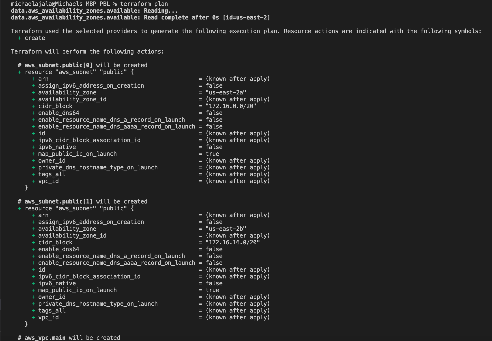

# AUTOMATE INFRASTRUCTURE WITH IAC USING TERRAFORM PART 1

This project shows how to use Terraform to automate the AWS infrastructure for two websites that were built manually in Project 15.

- Created an IAM user with admnistrative permission

- Copied the secret access key and access key ID.

- Configured programmatic access from my workstation to connect to AWS using the access keys copied and a Python SDK (boto3). Using the command below to install boto3

```
pip3 install boto3  
```

- Created an S3 bucket to store Terraform state file.


- I ran the command below to ensure that my CLI access was configured properly

```
aws s3 ls
```

- The result below printed the s3 bucket created earlier.


- In my Visual Studio created a folder and named it PBL

- Inside the PBL folder created a file and named it main.tf

- Added the following code to the main.tf file

```
provider "aws" {
  region = "us-east-2"
}

# Create VPC
resource "aws_vpc" "main" {
  cidr_block                     = "172.16.0.0/16"
  enable_dns_support             = "true"
  enable_dns_hostnames           = "true"
  enable_classiclink             = "false"
  enable_classiclink_dns_support = "false"
}
```

- Initiated the command `terraform init` to download necessary plugins for Terraform to work.


- To see what Terraform intends to create before instructing it to create the aws vpc resource, run the command below.

```
terraform plan
```


- Executed the plan with ```terraform apply```

A new file terraform.tfstate is created as a result of the above command which Terraform uses to keeps itself up to date with the exact state of the infrastructure and terraform.tfstate.lock.info file which Terraform uses to track who is running its code against the infrastructure at any point in time


- at this point my folder structure looks like this;


- Six subnets are required by the architectural design: 2 public subnets, 2 private subnets for webservers and 2 private subnet for data layers.

- The code below will create the 2 public subnet, added it to the main.tf file.

```
# Create public subnets1
    resource "aws_subnet" "public1" {
    vpc_id                     = aws_vpc.main.id
    cidr_block                 = "172.16.0.0/24"
    map_public_ip_on_launch    = true
    availability_zone          = "us-east-2a"

}

# Create public subnet2
    resource "aws_subnet" "public2" {
    vpc_id                     = aws_vpc.main.id
    cidr_block                 = "172.16.1.0/24"
    map_public_ip_on_launch    = true
    availability_zone          = "us-east-2b"
}
```

Note 2 subnets are being created, therefore 2 resources blocks were decalred - one for each of the subnets in different availability zone.

Since We are using the vpc_id argument to interpolate the value of the VPC id by setting it to aws_vpc.main.id. This way, Terraform knows inside which VPC to create the subnet.

### Refactoring The Codes

Inorder to make the work dynamic, hard coded values are removed by introducing variables

- created 2 files named variables.tf and terraform.tfvars

- The variables.tf consist of all variable declarations in the main.tf file. while the terraform.tfvars file consist of set values for each of the variables.

- The files are populated with the command below

main.tf 

```
# Get list of availability zones
data "aws_availability_zones" "available" {
state = "available"
}

provider "aws" {
  region = var.region
}

# Create VPC
resource "aws_vpc" "main" {
  cidr_block                     = var.vpc_cidr
  enable_dns_support             = var.enable_dns_support 
  enable_dns_hostnames           = var.enable_dns_support
  enable_classiclink             = var.enable_classiclink
  enable_classiclink_dns_support = var.enable_classiclink

}

# Create public subnets
resource "aws_subnet" "public" {
  count  = var.preferred_number_of_public_subnets == null ? length(data.aws_availability_zones.available.names) : var.preferred_number_of_public_subnets   
  vpc_id = aws_vpc.main.id
  cidr_block              = cidrsubnet(var.vpc_cidr, 4 , count.index)
  map_public_ip_on_launch = true
  availability_zone       = data.aws_availability_zones.available.names[count.index]
}
```

variable.tf

```
variable "region" {
      default = "us-east-2"
}

variable "vpc_cidr" {
    default = "172.16.0.0/16"
}

variable "enable_dns_support" {
    default = "true"
}

variable "enable_dns_hostnames" {
    default ="true" 
}

variable "enable_classiclink" {
    default = "false"
}

variable "enable_classiclink_dns_support" {
    default = "false"
}

  variable "preferred_number_of_public_subnets" {
      default = null
}
```

terraform.tfvars

```
region = "us-east-2"

vpc_cidr = "172.16.0.0/16" 

enable_dns_support = "true" 

enable_dns_hostnames = "true"  

enable_classiclink = "false" 

enable_classiclink_dns_support = "false" 

preferred_number_of_public_subnets = 2
```

The file structure then looks like this;


- Ran the command below to arrange the codes properly

```
terraform fmt
```

- Ran  `terraform plan`  to ensure there is no error in the configuration  files. then `terraform apply` to create resource.




- The image below shows that the VPC and subnets were created succesfully


